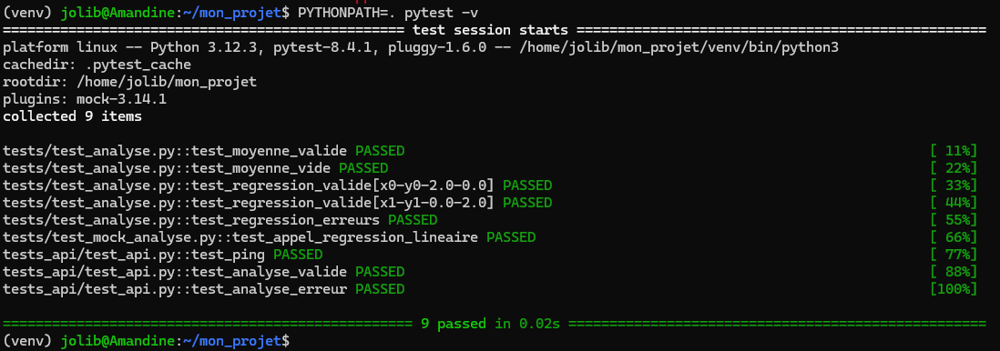

# Cahier des charges – Application d’analyse de données (Régression linéaire) avec API Flask
J.Gaber 

## Contexte et objectifs
L’objectif de ce projet est de développer une **application Python** permettant de réaliser :
1. Des **tests automatisés** (unitaires, mocks et API) avec `pytest`.
2. L’écriture de tests unitaires, paramétrés et ciblés avec mock.
3. La mise en place d’une API Flask et la rédaction de tests fonctionnels.
4. La configuration de CI/CD avec GitHub Actions (ou self-hosted runner).
5. Une **analyse de régression linéaire** sur un jeu de données.
6. Une **API REST** en Flask pour exposer cette analyse.


## Structure du projet
```
mon_projet/
├── analyse.py
├── test_analyse.py
├── test_mock_analyse.py
├── app.py
├── tests_api/
│   ├── conftest.py
│   └── test_api.py
├── requirements.txt
└── README.md
```

---

## 1. Prérequis et installation

1. **Créer la structure du projet en local** :
   ```bash
   mkdir mon_projet && cd mon_projet
   touch analyse.py test_analyse.py test_mock_analyse.py app.py README.md
   mkdir tests_api && touch tests_api/conftest.py tests_api/test_api.py
   ```
2. **Créer un environnement virtuel** et installer les dépendances :
   ```bash
   python3 -m venv venv
   source venv/bin/activate    # Linux/macOS
   venv\Scripts\activate     # Windows
   pip install flask pytest pytest-mock
   ```
3. **Fichier `requirements.txt`** :
   ```text
   flask
   pytest
   pytest-mock
   ```

---

## 2. Module d’analyse (`analyse.py`)
Créer `analyse.py` :
```python
from typing import List, Tuple

def moyenne(valeurs: List[float]) -> float:
    """Calcule la moyenne arithmétique d'une liste de nombres."""
    if not valeurs:
        raise ValueError("La liste ne peut pas être vide")
    return sum(valeurs) / len(valeurs)

def regression_lineaire(x: List[float], y: List[float]) -> Tuple[float, float]:
    """
    Calcule les coefficients a (pente) et b (ordonnée à l'origine) du modèle
    y = a*x + b par moindres carrés ordinaires (OLS).
    Renvoie (a, b).
    """
    if len(x) != len(y) or not x:
        raise ValueError("Listes x et y doivent être de même longueur et non vides")
    x_bar = moyenne(x)
    y_bar = moyenne(y)
    num = sum((xi - x_bar)*(yi - y_bar) for xi, yi in zip(x, y))
    den = sum((xi - x_bar)**2 for xi in x)
    if den == 0:
        raise ValueError("Division par zéro dans le calcul de la pente")
    a = num / den
    b = y_bar - a * x_bar
    return a, b
```

### 2.1 Tests ciblés avec mock (`test_mock_analyse.py`)
**But du mock** : isoler l’appel à `regression_lineaire` sans exécuter son algorithme.
```python
# test_mock_analyse.py
def test_appel_regression_lineaire(mocker):
    # Valeur simulée
    fake_a, fake_b = 3.14, 1.59
    # On stub la fonction
    mock_reg = mocker.patch('analyse.regression_lineaire', return_value=(fake_a, fake_b))
    # Appel
    x = [1, 2, 3]
    y = [2, 4, 6]
    a, b = regression_lineaire(x, y)
    # Vérifications
    mock_reg.assert_called_once_with(x, y)
    assert a == fake_a
    assert b == fake_b
```

---

## 3. Tests unitaires (`test_analyse.py`)
Créer `test_analyse.py` :
```python
# test_analyse.py
import pytest
from analyse import moyenne, regression_lineaire

def test_moyenne_valide():
    assert moyenne([1, 2, 3]) == pytest.approx(2.0)

def test_moyenne_vide():
    with pytest.raises(ValueError):
        moyenne([])

@pytest.mark.parametrize("x, y, a_attendu, b_attendu", [
    ([0, 1, 2], [0, 2, 4], 2.0, 0.0),
    ([1, 2, 3], [2, 2, 2], 0.0, 2.0),
])
def test_regression_valide(x, y, a_attendu, b_attendu):
    a, b = regression_lineaire(x, y)
    assert round(a, 3) == a_attendu
    assert round(b, 3) == b_attendu

def test_regression_erreurs():
    with pytest.raises(ValueError):
        regression_lineaire([], [])
    with pytest.raises(ValueError):
        regression_lineaire([1,1,1], [2,2,2])
```

---

## 4. API Flask (`app.py`)
Créer `app.py` :
```python
# app.py
from flask import Flask, request, jsonify
from analyse import regression_lineaire

app = Flask(__name__)

@app.route('/ping', methods=['GET'])
def ping():
    """Vérifie l’état du service."""
    return jsonify({"message": "pong"}), 200

@app.route('/analyse', methods=['POST'])
def analyse_route():
    """Exécute la régression et renvoie les coefficients."""
    data = request.get_json(force=True)
    x = data.get('x')
    y = data.get('y')
    try:
        a, b = regression_lineaire(x, y)
        return jsonify({"a": a, "b": b}), 200
    except Exception as e:
        return jsonify({"error": str(e)}), 400

if __name__ == '__main__':
    app.run(debug=True)
```

### 4.1 Exposition de l’API
- **Hôte** : `127.0.0.1`  
- **Port** : `5000`  
- **GET /ping** : statut 200, corps `{"message":"pong"}`  
- **POST /analyse** :  
  - **Entrée JSON** : `{"x":[...], "y":[...]}`  
  - **Réponse** : `{"a":<float>, "b":<float>}` ou `{"error":<message>}`  
- **Exemples curl** :
  ```bash
  curl http://127.0.0.1:5000/ping
  curl -X POST http://127.0.0.1:5000/analyse        -H "Content-Type: application/json"        -d '{"x":[0,1],"y":[0,2]}'
  ```

---

## 5. Tests de l’API (`tests_api/`)
### 5.1 Fixture (`tests_api/conftest.py`)
```python
# tests_api/conftest.py
import pytest
from app import app as flask_app

@pytest.fixture
def client():
    # Configure Flask en mode test
    flask_app.config['TESTING'] = True
    with flask_app.test_client() as client:
        yield client
```

### 5.2 Cas de test (`tests_api/test_api.py`)
```python
# tests_api/test_api.py
import json

def test_ping(client):
    r = client.get('/ping')
    assert r.status_code == 200
    assert r.get_json() == {"message": "pong"}

def test_analyse_valide(client):
    payload = {"x": [0,1,2], "y": [0,2,4]}
    r = client.post('/analyse', data=json.dumps(payload),
                    content_type='application/json')
    assert r.status_code == 200
    data = r.get_json()
    assert round(data["a"],3) == 2.0
    assert round(data["b"],3) == 0.0

def test_analyse_erreur(client):
    r = client.post('/analyse', json={"x": [], "y": []})
    assert r.status_code == 400
    assert "error" in r.get_json()
```

---

## 6. Lancement des tests et exécution
**Terminal (ou VSCode)** :
```bash
# Activer l'environnement
source venv/bin/activate    # Linux/macOS
venv\Scripts\activate     # Windows

# Exécuter les tests
pytest -v (PYTHONPATH=. pytest -v)



# Démarrer l'API
python app.py
```
**VSCode** : utiliser le terminal intégré et le panneau “Testing” pour lancer et visualiser les tests.

---

## 7. Gestion de version et CI

### 7.1 Git local & distant
```bash
# Initialisation locale
git init
git add .
git commit -m "Initial commit"

# Lier et pousser vers le distant
git remote add origin <URL_DU_DEPOT>
git push -u origin main
```

### 7.2 CI avec GitHub Actions
Créer `.github/workflows/python-ci.yml` :
```yaml
name: Python CI

on:
  push:
    branches: [ main ]
  pull_request:
    branches: [ main ]

jobs:
  build:
    runs-on: ubuntu-latest
    steps:
      - uses: actions/checkout@v2
      - uses: actions/setup-python@v2
        with:
          python-version: '3.x'
      - run: pip install -r requirements.txt
      - run: pytest -v
```
Chaque **push** ou **pull request** déclenche l’exécution de `pytest`.

### 7.3 Self-hosted runner (option sans frais GitHub-hosted)
1. Sur GitHub, aller dans **Settings > Actions > Runners > New self-hosted runner**.  
2. Choisir votre OS, télécharger et configurer l’agent :
   ```bash
   # Exemple Linux
   ./config.sh --url https://github.com/username/mon_projet                --token <TOKEN>                --labels self-hosted,linux
   ```
3. Démarrer le runner :
   ```bash
   ./run.sh
   ```
4. Adapter le workflow :
   ```yaml
   jobs:
     build:
       runs-on: self-hosted
       steps:
         - uses: actions/checkout@v2
         - uses: actions/setup-python@v2
           with: { python-version: '3.x' }
         - run: pip install -r requirements.txt
         - run: pytest -v
   ```

---

