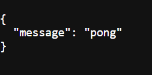

# Projet Python – Analyse de données avec API Flask & CI/CD

Lien GitHub : [https://github.com/amandine-jolibois/mon_projet](https://github.com/amandine-jolibois/mon_projet)
---

## Arborescence du projet

```bash
mon_projet/
├── app.py                # Point d’entrée de l’API Flask
├── analyse.py            # Module contenant la régression linéaire
├── tests/                # Tests unitaires
│   ├── test_analyse.py
│   └── test_mock_analyse.py
├── tests_api/            # Tests de l’API Flask
│   ├── test_api.py
│   └── conftest.py
├── requirements.txt      # Dépendances Python
├── .github/
│   └── workflows/
│       └── python-ci.yml # Déclencheur CI GitHub Actions
```

*Commentaires* :
- Le projet est structuré de manière claire.
- L’organisation facilite les tests et la maintenance.

---

## Régression linéaire (`analyse.py`)

La fonction principale calcule les coefficients `a` et `b` d’une droite d’ajustement.

```python
def regression_lineaire(x, y):
    ...
    return a, b
```

*Commentaire* : L’algorithme utilise la méthode des moindres carrés pour calculer la pente et l’ordonnée à l’origine.

---

## API Flask (`app.py`)

Deux routes disponibles :

- `GET /ping` → retourne un `pong`
- `POST /analyse` → retourne les coefficients de la régression



Exemple :

```bash
curl -X POST http://127.0.0.1:5000/analyse -H "Content-Type: application/json" -d '{"x":[1,2,3],"y":[2,4,6]}'
```

Résultat attendu :

```json
{
  "a": 2.0,
  "b": 0.0
}
```

---

## Tests unitaires (`tests/`)

Fichiers de test :

- `test_analyse.py` : vérifie les calculs
- `test_mock_analyse.py` : teste si la fonction est bien appelée via `pytest-mock`

*Commentaire* : Utilisation des assertions et des cas limites.

 : sortie `pytest -v` avec les 9 tests

---

## Tests de l’API (`tests_api/`)

Utilisation de `pytest` avec client Flask :

- `test_api.py` vérifie `/ping` et `/analyse`
- `conftest.py` crée un client pour les tests

Extrait de `conftest.py` :

```python
import pytest
from app import app as flask_app

@pytest.fixture
def client():
    flask_app.config['TESTING'] = True
    with flask_app.test_client() as client:
        yield client
```

*Commentaire* : Pratique pour isoler l’environnement de test.

---

## Fichier `requirements.txt`

```txt
Flask
pytest
pytest-mock
```

*Commentaire* : `pip freeze > requirements.txt`

---

## Intégration continue (CI)

### 7.1 GitHub Actions

Fichier `.github/workflows/python-ci.yml` :

```yaml
name: Python CI

on:
  push:
    branches: [ main ]
  pull_request:
    branches: [ main ]

jobs:
  build:
    runs-on: ubuntu-latest
    steps:
      - uses: actions/checkout@v2
      - uses: actions/setup-python@v2
        with:
          python-version: '3.x'
      - run: pip install -r requirements.txt
      - run: pytest -v
```

*Commentaire* : Chaque push sur `main` déclenche les tests automatiquement.

 Workflow dans l’onglet Actions sur GitHub

---

## Résultat obtenu

- Fonction `/ping` testée avec succès
- Fonction `/analyse` retourne bien les bons coefficients
- 9 tests exécutés avec succès
- CI GitHub Actions configurée sur la branche `main`

---

